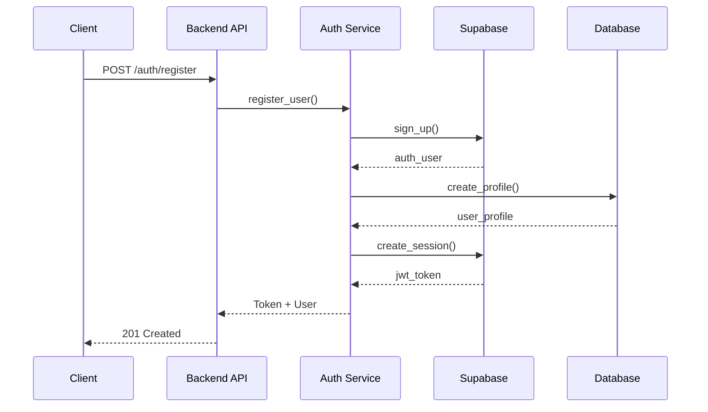
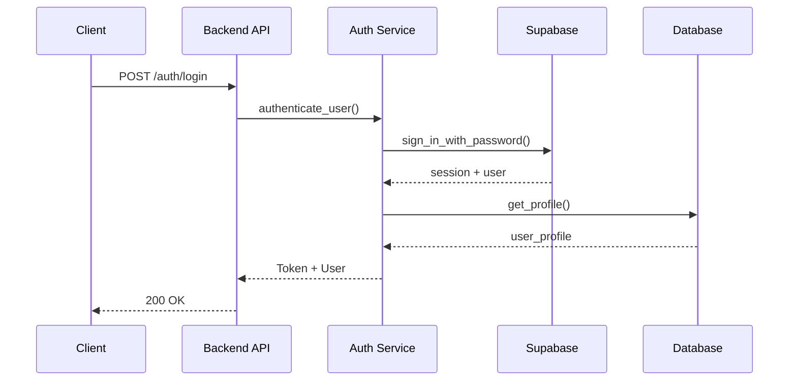
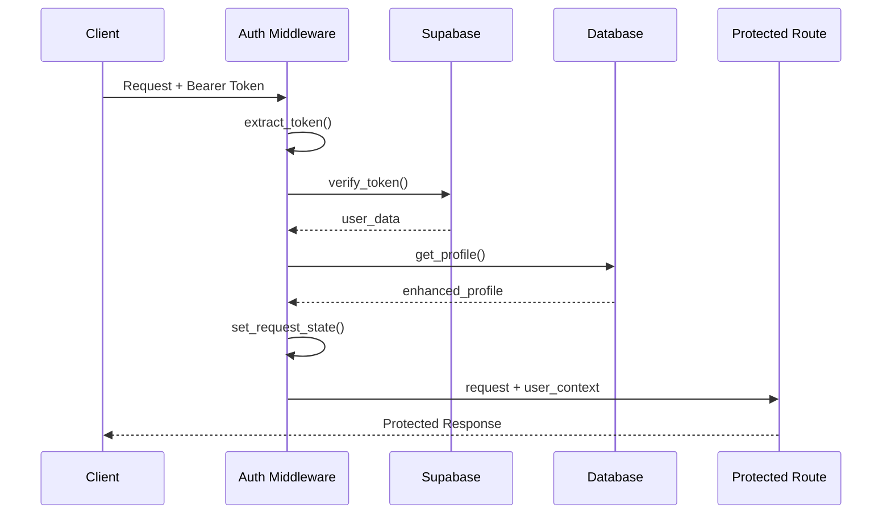

# Authentication System Architecture Documentation

## Overview

The Velro authentication system is a production-ready, security-hardened implementation that provides JWT-based authentication with Supabase integration. This document provides a comprehensive technical overview of the authentication architecture, security measures, and operational procedures.

## System Architecture

### High-Level Components

```
┌─────────────────┐    ┌─────────────────┐    ┌─────────────────┐
│   Frontend      │    │   Backend API   │    │   Supabase      │
│   (React)       │    │   (FastAPI)     │    │   Auth Service  │
├─────────────────┤    ├─────────────────┤    ├─────────────────┤
│ • Login UI      │◄──►│ • Auth Router   │◄──►│ • User Storage  │
│ • Token Storage │    │ • Auth Service  │    │ • JWT Signing   │
│ • Auto Refresh  │    │ • Middleware    │    │ • Password Hash │
│ • State Mgmt    │    │ • Security      │    │ • Email Verify │
└─────────────────┘    └─────────────────┘    └─────────────────┘
```

### Core Components

#### 1. Authentication Router (`routers/auth.py`)
- **Purpose**: HTTP endpoint handling for authentication operations
- **Endpoints**:
  - `POST /auth/login` - User authentication
  - `POST /auth/register` - User registration  
  - `GET /auth/me` - Current user info
  - `POST /auth/refresh` - Token refresh
  - `POST /auth/logout` - Session termination
  - `POST /auth/password-reset` - Password reset request
  - `POST /auth/password-reset-confirm` - Password reset confirmation
  - `PUT /auth/profile` - Profile updates
  - `GET /auth/security-info` - Security information

#### 2. Authentication Service (`services/auth_service.py`)
- **Purpose**: Business logic for authentication operations
- **Responsibilities**:
  - User registration and login
  - JWT token creation and management
  - Password validation and hashing
  - Supabase integration
  - Profile management

#### 3. Authentication Middleware (`middleware/auth.py`)
- **Purpose**: Request authentication and user context injection
- **Features**:
  - JWT token verification
  - User context injection
  - Rate limiting integration
  - Security logging
  - Performance optimization with caching

#### 4. Security Utilities (`utils/security.py`)
- **Purpose**: Cryptographic operations and security enforcement
- **Components**:
  - Password hashing (bcrypt)
  - JWT token management
  - Security validation
  - CSRF protection
  - Production security enforcement

#### 5. User Models (`models/user.py`)
- **Purpose**: Data validation and serialization
- **Models**:
  - `UserCreate` - Registration data
  - `UserLogin` - Login credentials
  - `UserResponse` - User information
  - `Token` - JWT token response
  - `PasswordReset` - Password reset requests

## Authentication Flow

### 1. User Registration Flow



### 2. User Login Flow



### 3. Request Authentication Flow



## Security Architecture

### 1. Multi-Layer Security

```
┌─────────────────────────────────────────────────────────────┐
│                     Security Layers                        │
├─────────────────────────────────────────────────────────────┤
│ Layer 1: Network Security (HTTPS, CORS, Headers)           │
│ Layer 2: Rate Limiting (Per-IP, Per-User, Per-Endpoint)    │
│ Layer 3: Input Validation (Pydantic, SQL Injection)        │
│ Layer 4: Authentication (JWT, Supabase, Multi-Factor)      │
│ Layer 5: Authorization (RBAC, Resource-Level Permissions)  │
│ Layer 6: Data Security (Encryption, Hashing, Sanitization) │
│ Layer 7: Monitoring (Logging, Alerts, Security Events)     │
└─────────────────────────────────────────────────────────────┘
```

### 2. JWT Security Implementation

#### Token Structure
```json
{
  "sub": "user_uuid",           // Subject (User ID)
  "email": "user@example.com",  // User email
  "iat": 1691234567,           // Issued at
  "exp": 1691321067,           // Expiration (24h default)
  "nbf": 1691234567,           // Not before
  "iss": "velro-api",          // Issuer
  "aud": "velro-frontend",     // Audience
  "jti": "unique_token_id",    // JWT ID for blacklisting
  "type": "access_token"       // Token type
}
```

#### Security Features
- **HMAC SHA-256 Signing**: Cryptographically secure signatures
- **Token Blacklisting**: Revocation support via JTI tracking
- **Expiration Enforcement**: Configurable token lifetimes
- **Audience Validation**: Prevents token misuse across services
- **Rate Limiting**: Protection against brute force attacks

### 3. Password Security

#### Hashing Algorithm
- **Algorithm**: bcrypt with configurable rounds (default: 12)
- **Salt**: Automatically generated per password
- **Validation**: OWASP-compliant password requirements
- **Storage**: Never store plaintext passwords

#### Password Requirements
- Minimum 8 characters
- Maximum 128 characters
- Must contain letters and numbers
- Prohibited: common passwords, personal information

### 4. Production Security Features

#### Environment-Based Security
```python
# Production Security Enforcement
if settings.is_production():
    # Disable debug features
    assert not settings.debug
    assert not settings.development_mode
    assert not settings.emergency_auth_mode
    
    # Enforce strong JWT secrets (64+ chars)
    assert len(settings.jwt_secret) >= 64
    
    # Require HTTPS
    assert settings.jwt_require_https
```

#### Security Headers
```python
SECURITY_HEADERS = {
    "X-Content-Type-Options": "nosniff",
    "X-Frame-Options": "DENY", 
    "X-XSS-Protection": "1; mode=block",
    "Referrer-Policy": "strict-origin-when-cross-origin",
    "Permissions-Policy": "geolocation=(), microphone=(), camera=()",
    "Strict-Transport-Security": "max-age=31536000; includeSubDomains; preload"
}
```

## Rate Limiting

### Endpoint-Specific Limits

| Endpoint | Rate Limit | Purpose |
|----------|------------|---------|
| `/auth/login` | 5/minute | Brute force protection |
| `/auth/register` | 3/minute | Account spam prevention |
| `/auth/refresh` | 10/minute | Token refresh abuse prevention |
| `/auth/password-reset` | 2/minute | Email spam prevention |
| `/auth/password-reset-confirm` | 5/minute | Reset token brute force |
| Standard API | 60/minute | General API protection |

### Implementation
```python
from middleware.rate_limiting import limit, auth_limit, api_limit

@router.post("/login")
@limit("5/minute")  # Strict rate limit
async def login(...):
    pass

@router.get("/me")
@api_limit()  # Standard rate limit
async def get_current_user_info(...):
    pass
```

## Database Integration

### User Profile Schema
```sql
CREATE TABLE users (
    id UUID PRIMARY KEY DEFAULT gen_random_uuid(),
    email TEXT UNIQUE,
    display_name TEXT,
    avatar_url TEXT,
    credits_balance INTEGER DEFAULT 1000,
    role TEXT DEFAULT 'viewer',
    created_at TIMESTAMP WITH TIME ZONE DEFAULT NOW(),
    updated_at TIMESTAMP WITH TIME ZONE DEFAULT NOW()
);
```

### Row Level Security (RLS)
- Users can only access their own data
- Service role bypasses RLS for admin operations
- Automatic profile creation on authentication

## Error Handling

### Security-Conscious Error Messages
```python
# Production-safe error handling
try:
    user = await auth_service.authenticate_user(credentials)
except SpecificError:
    # Log detailed error internally
    logger.error(f"Specific auth error: {detailed_error}")
    # Return generic error to client
    raise HTTPException(401, "Authentication failed")
```

### Error Categories
1. **Authentication Errors**: Invalid credentials, expired tokens
2. **Authorization Errors**: Insufficient permissions
3. **Validation Errors**: Invalid input data
4. **Rate Limit Errors**: Too many requests
5. **System Errors**: Service unavailable, database errors

## Monitoring and Logging

### Security Event Logging
```python
# Login attempt logging
logger.info(f"Login attempt from {client_ip} for {email}")

# Security violation logging  
logger.error(f"SECURITY_VIOLATION: {violation_type} from {client_ip}")

# Token usage tracking
logger.debug(f"Token verified for user {user_id}")
```

### Audit Trail
- All authentication events logged
- Failed login attempts tracked
- Security violations recorded
- Token usage monitored

## Performance Optimizations

### Caching Strategy
```python
# Token verification caching (60s TTL)
cache_key = f"auth_token:{token_hash}"
cached_user = await cache_manager.get(cache_key)

# Database query optimization
profile_result = db_client.service_client.table('users').select('*').eq('id', user_id).single()
```

### Connection Pooling
- Supabase client connection reuse
- Database connection pooling
- HTTP client session reuse

## Development vs Production Modes

### Development Mode Features
- Mock authentication tokens
- Relaxed security validations
- Debug logging enabled
- Emergency authentication fallbacks

### Production Mode Enforcement
- Strict security validations
- Real JWT tokens only
- HTTPS enforcement
- Security header injection
- Rate limiting enforcement

## Emergency Authentication

### Emergency Mode
- **Trigger**: `EMERGENCY_AUTH_MODE=true`
- **Purpose**: Temporary authentication bypass during incidents
- **Security**: Only works in development environments
- **Tokens**: Prefixed with `emergency_token_`
- **Monitoring**: All usage logged as security events

### Fail-Safe Mechanisms
- Graceful degradation during Supabase outages
- Automatic fallback to backup authentication
- Service health monitoring
- Circuit breaker patterns

## Integration Points

### Frontend Integration
- JWT token storage in secure HTTP-only cookies
- Automatic token refresh
- Auth state management
- Protected route handling

### Backend Integration
- Middleware-based user context injection
- Dependency injection for protected routes
- Service-to-service authentication
- Database connection management

## Compliance and Auditing

### Security Standards
- OWASP Top 10 compliance
- JWT best practices implementation
- GDPR-compliant data handling
- SOC 2 Type II controls

### Audit Capabilities
- Complete authentication event logging
- Security incident tracking
- User access auditing
- Compliance reporting

## Troubleshooting Guide

### Common Issues
1. **Token Verification Failures**: Check JWT secret configuration
2. **CORS Errors**: Verify allowed origins configuration
3. **Rate Limit Exceeded**: Review rate limiting settings
4. **Database Connection**: Check Supabase configuration
5. **Profile Creation**: Verify RLS policies

### Debug Tools
- `/auth/debug-auth` endpoint for middleware testing
- Comprehensive logging at debug level
- Health check endpoints
- Security information endpoint

This architecture provides a robust, scalable, and secure authentication system suitable for production deployment with comprehensive monitoring, error handling, and security measures.