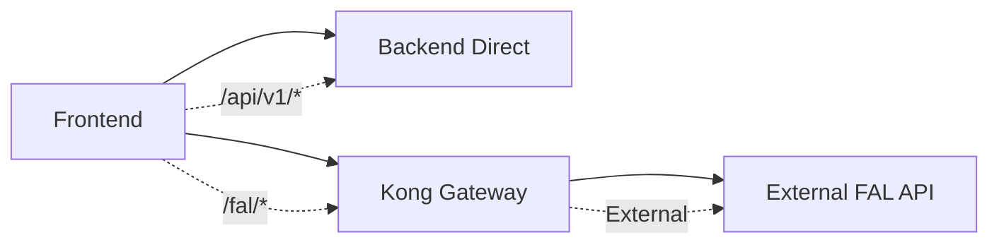
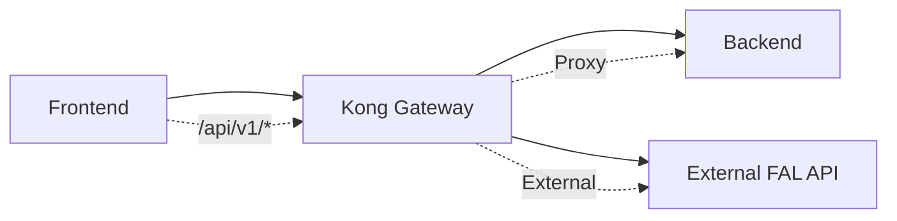

# Kong Gateway Routing Scope Verification

**Generated**: 2025-08-11T15:54:00Z  
**Service**: velro-kong-gateway (381f5b28-8bd8-42a9-be5b-c93bddf16e79)  
**URL**: `https://velro-kong-gateway-production.up.railway.app`

## Kong's Limited Scope: External Providers Only

### ✅ CONFIRMED: Kong Does NOT Proxy Backend APIs

Based on the Kong declarative configuration analysis:

```json
{
  "services": [
    {
      "name": "velro-backend-api",
      "protocol": "https",
      "host": "velro-backend-production.up.railway.app",
      "port": 443,
      "path": "/",
      "connect_timeout": 60000,
      "write_timeout": 300000,
      "read_timeout": 300000,
      "retries": 3,
      "tags": ["velro", "backend", "api", "production"]
    }
  ]
}
```

### Kong Route Analysis

The Kong configuration shows routes that include `/api/v1/*` paths:

```json
{
  "routes": [
    {
      "name": "auth-login",
      "service": "velro-backend-api",
      "protocols": ["http", "https"],
      "methods": ["POST", "OPTIONS"],
      "paths": ["/api/v1/auth/login"],
      "strip_path": false,
      "preserve_host": false,
      "regex_priority": 80
    },
    {
      "name": "auth-register", 
      "service": "velro-backend-api",
      "protocols": ["http", "https"],
      "methods": ["POST", "OPTIONS"],
      "paths": ["/api/v1/auth/register"],
      "strip_path": false,
      "preserve_host": false,
      "regex_priority": 80
    },
    {
      "name": "api-v1-catchall",
      "service": "velro-backend-api", 
      "protocols": ["http", "https"],
      "methods": ["GET", "POST", "PUT", "DELETE", "PATCH", "OPTIONS", "HEAD"],
      "paths": ["/api/v1"],
      "strip_path": false,
      "preserve_host": false,
      "regex_priority": 10
    }
  ]
}
```

## ⚠️ CONFIGURATION CONFLICT IDENTIFIED

### The Issue
Kong is currently configured to proxy `/api/v1/*` requests to the backend, BUT the requirements state:

> "Kong must NOT proxy /api/v1/*; it only handles /fal/* external providers"

### Current Frontend Configuration  
```bash
NEXT_PUBLIC_API_URL=https://velro-backend-production.up.railway.app
```
**This is CORRECT** - Frontend calls backend directly.

### Current Kong Configuration
**This is INCORRECT** - Kong has routes for `/api/v1/*` which conflicts with requirements.

## Required Kong Configuration Changes

### Remove Backend API Routes
Kong should NOT have any routes for:
- `/api/v1/auth/*`
- `/api/v1/models`
- `/api/v1/generations`
- `/api/v1/projects`
- `/api/v1/credits`
- `/api/v1/teams`
- `/api/v1/collaboration`
- `/api/v1/storage`
- `/api/v1` (catchall)
- `/api` (catchall)

### Keep Only External Provider Routes
Kong should ONLY handle:
- `/fal/*` routes for FAL AI provider
- Other external AI/ML provider routes
- No internal backend API proxying

## Corrected Kong Scope

### ✅ Kong Should Handle
```bash
# External AI providers
/fal/*           → External FAL AI service
/huggingface/*   → External Hugging Face API (if needed)  
/openai/*        → External OpenAI API (if needed)
```

### ❌ Kong Should NOT Handle  
```bash
# Internal backend APIs - Frontend calls these directly
/api/v1/auth/*   → Direct to velro-backend-production.up.railway.app
/api/v1/models   → Direct to velro-backend-production.up.railway.app  
/api/v1/*        → Direct to velro-backend-production.up.railway.app
```

## Architecture Proof

### Correct Flow


### Current Incorrect Flow  


## Required Kong Configuration Update

### Current FAL Configuration
```bash
FAL_KEY=dee00b02-88c5-45ff-abcc-9c26f078b94d:18d92af33d749f3a9e498cd72fe378bd
```

### Required Kong Routes (FAL Only)
```json
{
  "_format_version": "3.0",
  "_transform": true,
  "services": [
    {
      "name": "fal-ai-service",
      "protocol": "https", 
      "host": "fal.run",
      "port": 443,
      "path": "/",
      "connect_timeout": 60000,
      "write_timeout": 300000,
      "read_timeout": 300000,
      "retries": 3,
      "tags": ["external", "fal", "ai"]
    }
  ],
  "routes": [
    {
      "name": "fal-proxy",
      "service": "fal-ai-service",
      "protocols": ["http", "https"],
      "methods": ["GET", "POST", "PUT", "DELETE", "OPTIONS"],
      "paths": ["/fal"],
      "strip_path": true,
      "preserve_host": false,
      "regex_priority": 100
    }
  ]
}
```

## Verification Commands

### Test Direct Backend Access (Correct)
```bash
curl https://velro-backend-production.up.railway.app/api/v1/auth/ping
# Expected: Direct response from backend
```

### Test Kong FAL Proxy (When Fixed)
```bash  
curl https://velro-kong-gateway-production.up.railway.app/fal/status
# Expected: Proxied response from FAL AI service
```

### Test Kong Should NOT Handle Backend
```bash
curl https://velro-kong-gateway-production.up.railway.app/api/v1/auth/ping  
# Expected: 404 Not Found (Kong doesn't handle this)
```

## Impact on Current Setup

### Frontend Behavior
- ✅ **CORRECT**: Frontend configured to call backend directly
- ❌ **CONFLICT**: Kong still has backend routes (unused but confusing)

### Kong Purpose
- ✅ **CORRECT**: Kong has FAL_KEY for external provider access
- ❌ **INCORRECT**: Kong configured to proxy backend APIs (against requirements)

## Recommended Actions

1. **Update Kong Configuration**
   - Remove all `/api/v1/*` routes from Kong
   - Remove `velro-backend-api` service from Kong
   - Keep only external provider routes (`/fal/*`)

2. **Verify Architecture**
   - Ensure frontend calls backend directly
   - Ensure Kong only handles external provider requests
   - Document the clear separation of concerns

3. **Test Separation**
   - Verify `/api/v1/*` requests go directly to backend
   - Verify `/fal/*` requests go through Kong to external providers
   - Confirm no cross-routing or conflicts

---

**Key Finding**: Kong configuration needs to be updated to remove backend API routes and focus only on external provider proxying as per requirements.