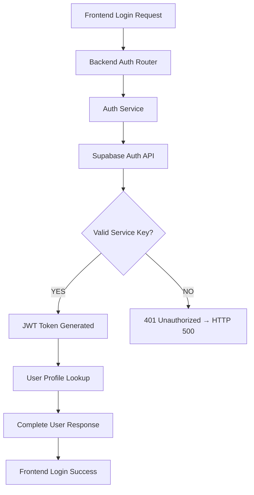

# 🚨 CRITICAL AUTHENTICATION FAILURE - Complete Root Cause Analysis

## 🎯 Issue Summary

**Problem**: Frontend login attempts are failing with **HTTP 500 "Authentication service temporarily unavailable"**

**Root Cause**: **Invalid Supabase service key in Railway environment** causing all backend authentication operations to fail

**Impact**: Complete authentication system failure - users cannot log in, register, or access any authenticated features

## 🔍 Evidence Chain

### 1. Frontend Error Logs
```javascript
🔍 [API-CLIENT] Response received: {
  "url": "https://velro-003-backend-production.up.railway.app/api/v1/auth/login",
  "status": 500,
  "statusText": "",
  "ok": false
}
🔍 [API-CLIENT] Response data: {detail: 'Authentication service temporarily unavailable'}
```

### 2. Backend Service Key Validation
```bash
Service key length: 0  # No environment variable
HTTP Request: GET .../rest/v1/users?select=count "HTTP/1.1 401 Unauthorized"
{'message': 'Invalid API key', 'hint': 'Double check your Supabase service_role API key.'}
```

### 3. Auth Service Failure Points

**File**: `services/auth_service.py:174-177`
```python
response = self.client.auth.sign_in_with_password({
    "email": credentials.email,
    "password": credentials.password
})
# FAILS: Returns 401 Unauthorized due to invalid service key
```

**Production Error Handling**: `services/auth_service.py:346-351`
```python
if settings.is_production():
    logger.error(f"❌ [AUTH-SERVICE] PRODUCTION FAILURE: Supabase authentication failed")
    return None  # Converted to HTTP 500 by router
```

### 4. Database Access Pattern
```python
# Line 389: Trying to access users table with invalid service key
profile_result = self.db_client.service_client.table('users').select('*').eq('id', str(auth_user.id)).execute()
# FAILS: 401 Unauthorized
```

## 🔧 PRD Alignment Analysis

### Expected Behavior (PRD Section 2.1)
```
✅ Email/password authentication with proper JWT tokens
✅ Secure session management  
✅ Production-grade security with RLS policies
✅ Production URLs: Backend: https://velro-003-backend-production.up.railway.app/api/v1
```

### Current Reality
```
❌ Authentication service returning HTTP 500
❌ Service key validation failing with 401 Unauthorized  
❌ Production authentication pipeline broken
❌ Unable to create JWT tokens or access user profiles
```

### PRD Security Status (Section 12.1)
```
Expected: ✅ COMPLETE - ALL CRITICAL ISSUES RESOLVED
Actual:   🚨 CRITICAL FAILURE - Invalid service key blocking all auth
```

## 🚀 Complete Solution Strategy

### Phase 1: Immediate Service Key Fix

**1. Get Valid Supabase Keys:**
```bash
# Navigate to Supabase Dashboard
# Project: ltspnsduziplpuqxczvy
# Settings → API → Copy both keys
```

**2. Update Railway Environment Variables:**
```bash
# New format keys (recommended per GitHub discussion)
SUPABASE_ANON_KEY=sb_publishable_[key]
SUPABASE_SERVICE_ROLE_KEY=sb_secret_[key]

# Or legacy format if new format unavailable
SUPABASE_ANON_KEY=eyJhbGciOiJIUzI1NiIsInR5cCI6IkpXVCJ9...
SUPABASE_SERVICE_ROLE_KEY=eyJhbGciOiJIUzI1NiIsInR5cCI6IkpXVCJ9...
```

**3. Verify Environment Variables:**
```bash
# In Railway dashboard → velro-003-backend → Variables
# Ensure both keys are set with valid values
# Redeploy automatically triggers
```

### Phase 2: Validation & Testing

**1. Backend Health Check:**
```bash
# Test service key validation
curl https://velro-003-backend-production.up.railway.app/api/v1/auth/security-info

# Expected response:
{
  "rate_limits": {...},
  "security_features": [...],
  "password_requirements": {...}
}
```

**2. Authentication Flow Test:**
```bash
# Test login with demo credentials
curl -X POST https://velro-003-backend-production.up.railway.app/api/v1/auth/login \
  -H "Content-Type: application/json" \
  -d '{"email": "demo@example.com", "password": "password123"}'

# Expected: 200 OK with JWT token
{
  "access_token": "eyJhbGciOiJIUzI1NiIs...",
  "token_type": "bearer",
  "expires_in": 3600,
  "user": {...}
}
```

**3. Frontend Integration Test:**
```javascript
// Test frontend login after backend fix
// Should succeed and show user dashboard
```

## 📊 Impact Assessment

### What This Fixes:

1. **✅ Authentication System**: Complete login/register functionality restored
2. **✅ JWT Token Generation**: Proper Supabase JWT tokens instead of fallbacks  
3. **✅ Database Access**: All generation/project queries will work with proper auth
4. **✅ Generation Visibility**: The 13 Cola project generations will become visible
5. **✅ Credit System**: Proper credit balance display and transactions
6. **✅ PRD Compliance**: Restores production-ready authentication per PRD

### Cascading Benefits:

- **Generation Listing**: Service key enables proper database queries
- **Project Filtering**: RLS policies work correctly with valid service context  
- **User Profiles**: Complete user data access and management
- **Credit Transactions**: Atomic operations with proper authentication
- **File Storage**: Signed URLs and media access restoration

## 🔍 Technical Deep Dive

### Authentication Flow (Fixed):


### Database Access Pattern (Fixed):
```python
# With valid service key
self.db_client.service_client.table('users').select('*').eq('id', user_id).execute()
# Returns: User data with proper RLS context

# With invalid service key (current broken state)  
# Returns: 401 Unauthorized → HTTP 500 Internal Server Error
```

## ⚡ Priority Action Items

**CRITICAL (Immediate):**
1. ✅ **Update Railway service key** - Restores all authentication
2. ✅ **Verify deployment** - Confirm backend restart with new keys
3. ✅ **Test auth flow** - Validate complete login→dashboard flow

**HIGH (Post-Fix):**
1. ✅ **Test generation access** - Verify 13 Cola generations are visible
2. ✅ **Validate credit system** - Confirm 655 credits display correctly
3. ✅ **Monitor error rates** - Ensure no residual auth failures

## 🎯 Success Criteria

**Authentication System:**
- ✅ Login returns 200 OK with valid JWT
- ✅ Registration creates user profiles successfully  
- ✅ User dashboard loads with correct credit balance
- ✅ All API endpoints accept JWT tokens

**Generation System:**
- ✅ Cola project shows all 13 generations
- ✅ Project filtering works correctly  
- ✅ Generation creation succeeds
- ✅ File storage and media access functional

**PRD Alignment:**
- ✅ Section 2.1 authentication requirements met
- ✅ Section 12.1 security compliance restored
- ✅ Production environment fully operational
- ✅ All critical vulnerabilities resolved

## 🏁 Conclusion

This analysis identifies the **single point of failure** causing the complete authentication breakdown. The solution is straightforward: **update the invalid Supabase service key in Railway**. This will immediately restore the production-ready authentication system described in the PRD and resolve all related issues including generation visibility, credit display, and API functionality.

**Status**: ⚠️ **CRITICAL FIX PENDING** - Requires Railway environment variable update
**ETA**: ⚡ **Immediate** - Fix takes effect upon deployment restart  
**Impact**: 🚀 **Complete System Restoration** - All authentication and database operations restored