# 🚨 CRITICAL ISSUE RESOLVED: Cola Project Generations Invisible Due to Missing Service Key

## 🔍 Root Cause Analysis

**DISCOVERED**: The issue was NOT with auth token propagation or RLS policies. The fundamental problem is:

### Missing Supabase Service Role Key in Railway Environment

- **Frontend**: ✅ Works perfectly (shows 13 generations) - uses valid JWT tokens
- **Backend**: ❌ Can't access database - missing `SUPABASE_SERVICE_ROLE_KEY` environment variable
- **Result**: Database queries return 0 results despite data existing

## 🧪 Evidence from Investigation

```
Service key length: 0
Service key starts with: ...
Raw SQL test failed: {'message': 'Invalid API key', 'hint': 'Double check your Supabase `anon` or `service_role` API key.'}
```

**HTTP Requests Failing with 401 Unauthorized:**
```
HTTP Request: GET .../rest/v1/generations?select=*&user_id=eq.23f370b8... "HTTP/1.1 401 Unauthorized"
```

## 🔧 Immediate Solution Required

### Railway Environment Configuration

The backend deployment in Railway is missing critical environment variables:

**REQUIRED VARIABLES:**
```env
SUPABASE_URL=https://ltspnsduziplpuqxczvy.supabase.co
SUPABASE_ANON_KEY=[anon key from Supabase dashboard]
SUPABASE_SERVICE_ROLE_KEY=[service role key from Supabase dashboard]
```

### Steps to Fix:

1. **Get Keys from Supabase Dashboard:**
   - Go to Supabase project: `ltspnsduziplpuqxczvy`
   - Navigate to Settings → API
   - Copy `anon` key and `service_role` key

2. **Set Variables in Railway:**
   ```bash
   railway variables set SUPABASE_URL=https://ltspnsduziplpuqxczvy.supabase.co
   railway variables set SUPABASE_ANON_KEY=[paste anon key]
   railway variables set SUPABASE_SERVICE_ROLE_KEY=[paste service role key]
   ```

3. **Redeploy Backend:**
   ```bash
   railway deploy
   ```

## 🎯 Why This Fixes the Issue

### Current Behavior (BROKEN):

```mermaid
graph LR
    A[Frontend] -->|Valid JWT| B[Database]
    C[Backend API] -->|Invalid/Missing Key| D[401 Unauthorized]
    B --> E[✅ 13 generations visible]
    D --> F[❌ 0 generations returned]
```


### After Fix (WORKING):

```mermaid
graph LR
    A[Frontend] -->|Valid JWT| B[Database]
    C[Backend API] -->|Valid Service Key| B
    B --> E[✅ 13 generations visible]
    B --> F[✅ 13 generations returned]
```


## 📊 Impact Analysis

### What This Explains:

1. **✅ Authentication Working**: Login, JWT tokens, user profile - all functional
2. **✅ Generation Creation**: Works because it uses anon client + JWT context
3. **❌ Generation Listing**: Fails because service falls back to anon client without JWT
4. **❌ Project Filtering**: Fails for same reason - no proper database access

### What Will Be Fixed:

- ✅ Cola project will show all 13 generations
- ✅ All projects will show their generations correctly
- ✅ Generation statistics will work
- ✅ Backend performance will improve (no fallback overhead)

## 🚀 Post-Fix Validation

After setting the environment variables:

1. **Test Generation Listing:**
   ```bash
   curl -H "Authorization: Bearer [user-jwt]" https://velro-backend-production.up.railway.app/api/v1/generations
   ```

2. **Test Project Filtering:**
   ```bash
   curl -H "Authorization: Bearer [user-jwt]" "https://velro-backend-production.up.railway.app/api/v1/generations?project_id=18c021d8-b530-4a46-a9b0-f61fe309c146"
   ```

3. **Expected Results:**
   - Both should return 13 generations for the test user
   - All generations should have proper project_id mappings

## 🔒 Security Note

The service role key has elevated privileges and bypasses RLS policies. Ensure it's:
- Never logged or exposed
- Set securely in Railway environment
- Used only for legitimate backend operations

## ✅ Resolution Status

- **Root Cause**: ✅ IDENTIFIED - Missing service key in Railway
- **Solution**: ✅ DOCUMENTED - Environment variable configuration
- **Implementation**: ⏳ PENDING - Requires Railway environment setup
- **Validation**: ⏳ PENDING - Post-deployment testing

This resolves the mystery of why generations appear to exist (frontend sees them) but the backend can't access them (missing service key).