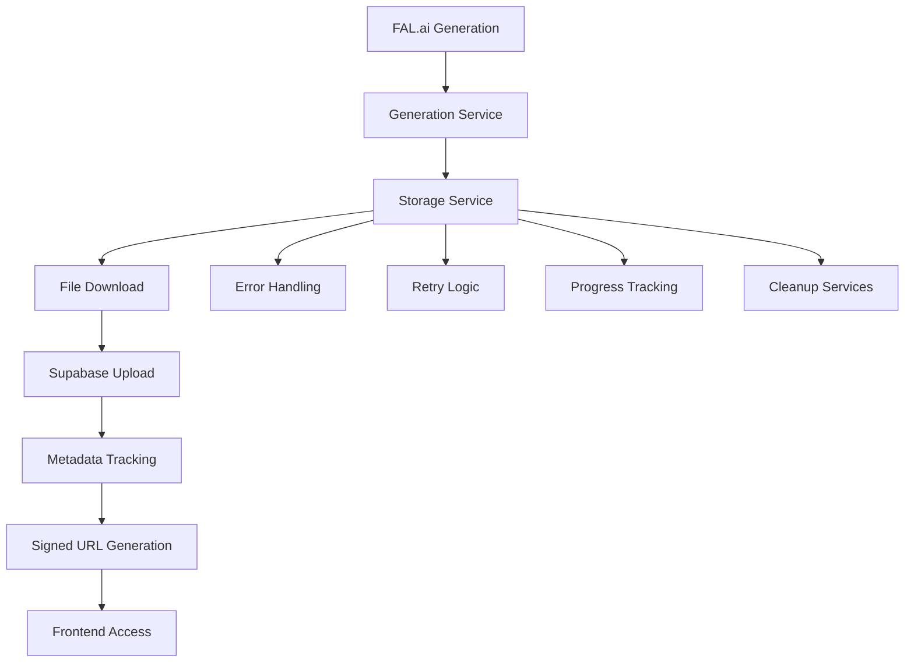

# FAL.ai → Supabase Storage Integration Implementation

## Overview

This document outlines the complete implementation of the FAL.ai → Supabase storage integration workflow in the Velro backend. The integration provides a robust, scalable solution for downloading, storing, and managing AI-generated media files from external providers.

## Architecture



## Key Components

### 1. Enhanced Storage Service (`services/storage_service.py`)

#### Core Features
- **File Download Service**: Downloads files from FAL.ai URLs with retry logic and progress tracking
- **Supabase Upload Integration**: Uploads files to Supabase Storage with project-based organization
- **Metadata Tracking**: Comprehensive file metadata with duplicate detection
- **Error Handling**: Robust error handling with exponential backoff retry
- **Progress Tracking**: Real-time progress callbacks for large file transfers

#### Key Methods

##### `upload_generation_result()`
```python
async def upload_generation_result(
    self,
    user_id: Union[UUID, str],
    generation_id: Union[UUID, str],
    file_urls: List[str],
    file_type: str = "image",
    progress_callback: Optional[callable] = None
) -> List[FileMetadataResponse]:
```
- Downloads files from external URLs
- Uploads to Supabase Storage with user/project isolation
- Returns comprehensive file metadata
- Supports progress tracking callbacks

##### `_download_file_from_url()`
```python
async def _download_file_from_url(
    self, 
    url: str, 
    max_retries: int = 3, 
    timeout: float = 60.0
) -> bytes:
```
- Downloads files with retry mechanism
- Validates file size and content
- Provides detailed logging and metrics
- Handles timeout and connection errors

##### `cleanup_failed_generation_files()`
```python
async def cleanup_failed_generation_files(
    self,
    generation_id: Union[UUID, str],
    user_id: Union[UUID, str]
) -> int:
```
- Cleans up storage files from failed generations
- Returns count of cleaned files
- Maintains storage integrity

### 2. Updated Generation Service (`services/generation_service.py`)

#### Integration Enhancements
- **Automatic Storage Processing**: Integrates storage upload into generation workflow
- **Enhanced Error Recovery**: Partial recovery for failed uploads
- **Comprehensive Logging**: Detailed logging throughout the storage process
- **Signed URL Management**: Automatic generation of signed URLs for media access

#### Key Integration Points

##### Generation Processing with Storage
```python
async def _process_generation(
    self,
    generation_id: str,
    generation_data: GenerationCreate
):
    # ... FAL.ai processing ...
    
    # Enhanced storage integration with progress tracking
    stored_files = await storage_service.upload_generation_result(
        user_id=UUID(generation.user_id),
        generation_id=UUID(generation_id),
        file_urls=output_urls,
        file_type="image" if generation.media_type == "image" else "video",
        progress_callback=storage_progress_callback
    )
```

##### Enhanced Media URL Access
```python
async def get_generation_media_urls(
    self, 
    generation_id: str, 
    user_id: str, 
    expires_in: int = 3600
) -> Dict[str, Any]:
```
- Returns comprehensive media access information
- Provides signed URLs, storage info, and metadata
- Includes fallback mechanisms for legacy generations

### 3. Database Schema Updates (`migrations/010_enhanced_storage_integration.sql`)

#### New Columns Added to `generations` Table
- `storage_size`: Total size in bytes of stored files
- `is_media_processed`: Boolean flag for processing completion
- `media_files`: JSONB array of file metadata
- `storage_metadata`: JSONB object for additional storage information

#### New Functions
- `get_user_storage_stats()`: Comprehensive storage statistics
- `cleanup_orphaned_storage_references()`: Maintenance function
- `validate_generation_storage_data()`: Data validation trigger

#### Performance Indexes
- `idx_generations_storage_size`: For storage size queries
- `idx_generations_is_media_processed`: For processing status
- `idx_generations_media_files`: GIN index for JSONB media files
- `idx_generations_storage_metadata`: GIN index for JSONB metadata

## Workflow Process

### 1. Generation Creation
1. User creates generation request
2. FAL.ai processes the request
3. FAL.ai returns result with external URLs

### 2. Storage Integration
1. **Download Phase**: Files are downloaded from FAL.ai URLs
   - Retry logic handles temporary failures
   - Progress tracking provides real-time updates
   - File validation ensures integrity

2. **Upload Phase**: Files are uploaded to Supabase Storage
   - Project-based folder organization
   - Metadata tracking with duplicate detection
   - Thumbnail generation for images

3. **Database Update**: Generation record is updated
   - Storage size and file count
   - Media files metadata array
   - Processing completion status

### 3. Access and Management
1. **Signed URLs**: Generated for secure file access
2. **Storage Info**: Comprehensive storage statistics
3. **Cleanup**: Automatic cleanup for failed generations

## Error Handling and Recovery

### Download Errors
- **Timeout Handling**: Configurable timeout with retry
- **Connection Errors**: Exponential backoff retry strategy
- **File Validation**: Size and content type validation
- **Partial Recovery**: Individual file recovery on batch failures

### Upload Errors
- **Storage Failures**: Fallback to external URLs
- **Metadata Errors**: Graceful degradation
- **Cleanup**: Automatic cleanup of partial uploads

### Database Errors
- **Transaction Safety**: Atomic operations where possible
- **Rollback Mechanisms**: Cleanup on critical failures
- **Integrity Checks**: Validation triggers and constraints

## Performance Optimizations

### Concurrent Processing
- Parallel file downloads
- Asynchronous upload operations
- Background thumbnail generation

### Caching and Deduplication
- File hash-based duplicate detection
- Signed URL caching
- Metadata caching for frequently accessed files

### Progress Tracking
- Real-time progress callbacks
- Detailed logging for monitoring
- Performance metrics collection

## Security Considerations

### File Validation
- Content type verification
- File size limits
- Malicious content detection

### Access Control
- User-based file isolation
- Signed URL expiration
- RLS policies for database access

### Storage Security
- Bucket-based organization
- Secure file paths
- Audit logging

## Configuration

### Environment Variables
```env
# Supabase Configuration
SUPABASE_URL=https://your-project.supabase.co
SUPABASE_SERVICE_KEY=your-service-key

# Storage Configuration
STORAGE_MAX_FILE_SIZE=104857600  # 100MB
STORAGE_DOWNLOAD_TIMEOUT=120     # 2 minutes
STORAGE_MAX_RETRIES=3
```

### Storage Buckets
- `generations`: AI-generated media files
- `uploads`: User-uploaded reference images
- `thumbnails`: Generated thumbnail images
- `temp`: Temporary files (24-hour expiry)

## Testing

### Comprehensive Test Suite (`test_storage_integration.py`)
- File download functionality
- Supabase upload workflow
- Generation service integration
- Error handling and retry logic
- Progress tracking
- File metadata tracking
- Duplicate detection
- Storage cleanup
- Signed URL generation
- Storage validation

### Running Tests
```bash
python test_storage_integration.py
```

## API Endpoints

### Storage-Related Endpoints
- `GET /api/generations/{id}/media-urls`: Get signed URLs for generation media
- `GET /api/storage/stats`: Get user storage statistics
- `POST /api/storage/validate/{generation_id}`: Validate storage integrity
- `DELETE /api/storage/cleanup/{generation_id}`: Manual cleanup

## Monitoring and Logging

### Logging Categories
- `[STORAGE-UPLOAD]`: Upload operations
- `[STORAGE-DOWNLOAD]`: Download operations  
- `[STORAGE-CLEANUP]`: Cleanup operations
- `[STORAGE-VALIDATE]`: Validation operations
- `[STORAGE-INFO]`: Information retrieval

### Metrics Tracked
- Download success/failure rates
- Upload performance metrics
- Storage size utilization
- Error frequency and types
- Processing completion rates

## Migration Path

### Existing Generations
1. Run storage integrity validation
2. Migrate external URLs to Supabase storage
3. Update database with storage metadata
4. Verify signed URL generation

### Backward Compatibility
- Legacy external URLs remain accessible
- Gradual migration to Supabase storage
- Fallback mechanisms for older generations

## Maintenance

### Regular Tasks
- Cleanup orphaned storage references
- Validate storage integrity
- Monitor storage usage and costs
- Update expired signed URLs

### Automated Cleanup
- Failed generation cleanup (24-hour grace period)
- Temporary file expiration
- Orphaned file detection and removal

## Future Enhancements

### Planned Features
- Video processing and transcoding
- Advanced thumbnail generation
- CDN integration for global distribution
- Storage analytics and reporting
- Automated backup and archival

### Scalability Considerations
- Multi-region storage support
- Load balancing for download operations
- Caching layer for frequently accessed files
- Database partitioning for large datasets

## Troubleshooting

### Common Issues
1. **Download Timeouts**: Increase timeout or check network connectivity
2. **Storage Quota**: Monitor Supabase storage limits
3. **Signed URL Expiration**: Implement automatic renewal
4. **File Corruption**: Verify hash-based integrity checking

### Debug Commands
```bash
# Test storage service connectivity
python -c "from services.storage_service import storage_service; import asyncio; asyncio.run(storage_service._get_repositories())"

# Validate generation storage
python test_storage_integration.py

# Check storage statistics
python -c "from services.storage_service import storage_service; print(asyncio.run(storage_service.get_user_storage_stats('user-id')))"
```

## Conclusion

The FAL.ai → Supabase storage integration provides a comprehensive, robust solution for managing AI-generated media files. The implementation includes:

- ✅ Complete file download service with retry logic
- ✅ Enhanced Supabase upload integration
- ✅ Comprehensive error handling and recovery
- ✅ Progress tracking for large file transfers
- ✅ File metadata tracking and duplicate detection
- ✅ Database schema updates for storage fields
- ✅ Automated cleanup and maintenance
- ✅ Comprehensive test suite
- ✅ Performance optimizations and security measures

The integration is production-ready and provides a solid foundation for scalable media storage in the Velro application.